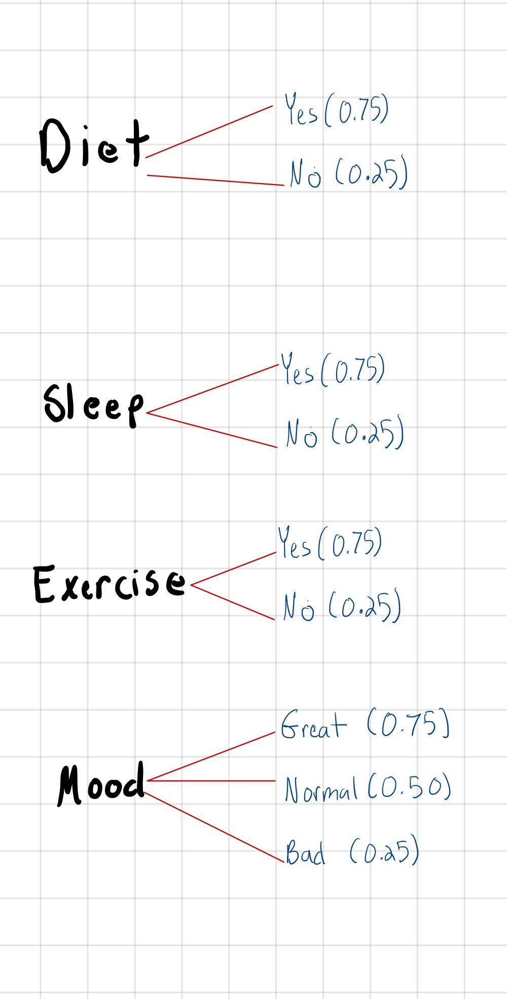
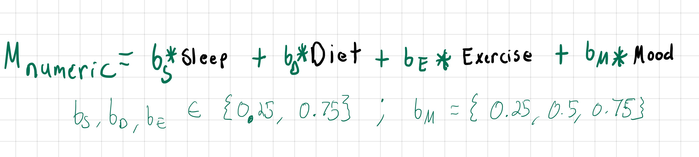
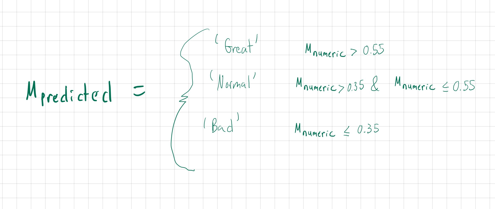
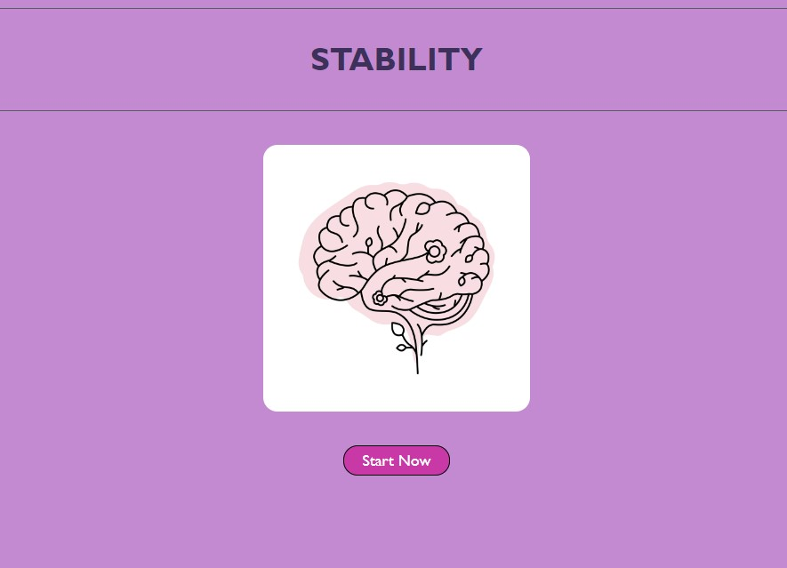
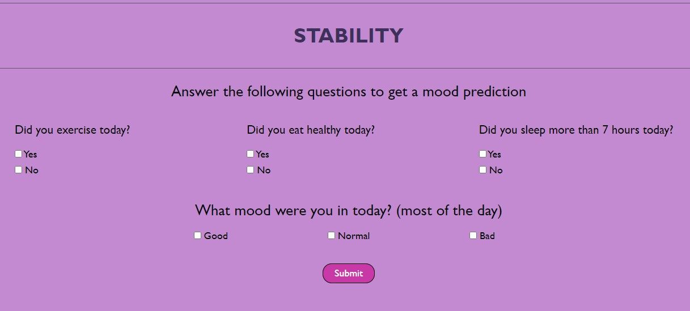
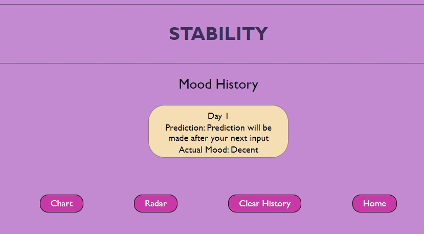
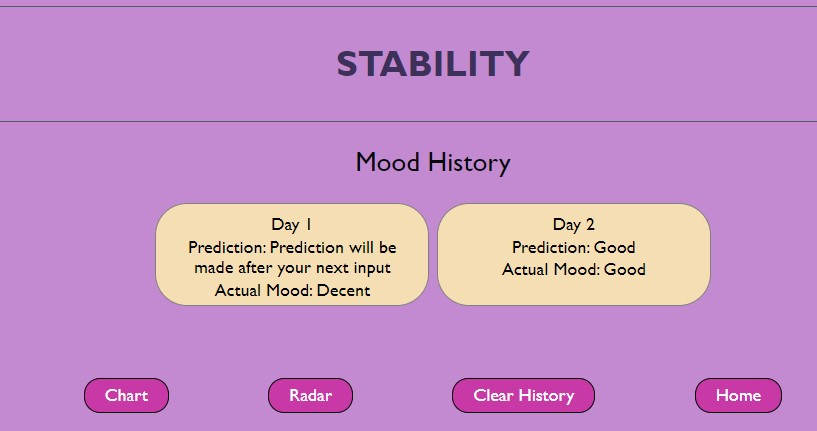
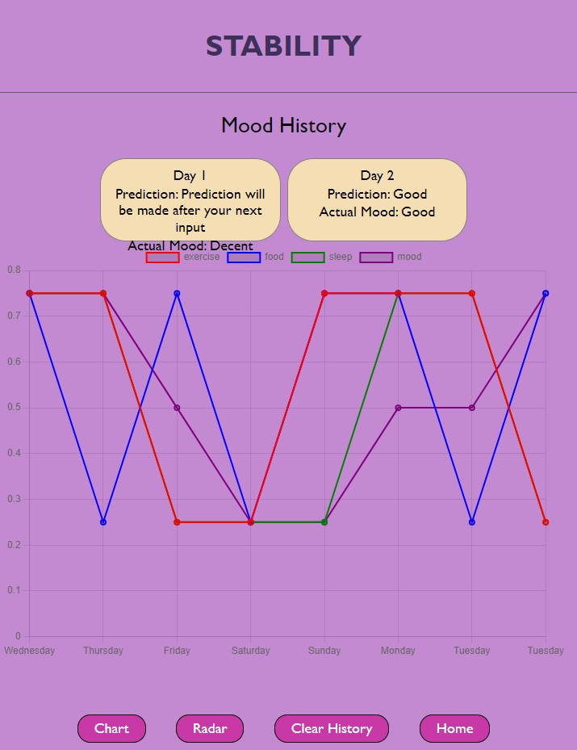

# STABILITY
This repo will contain code for our Stability App project

## Purpose:
The primary purpose of stability is to make predictions of someone’s mood based on their diet, exercise, sleep, and mood. The current model makes predictions of someone’s mood based on fixed regression coefficients That are multiplied by the previous state(s).

There are two different visualizations that are displayed based on someone’s diet, exercise, sleep, and mood. The Radar plot is designed to display either an average of the following time intervals to compare: 1 week ago vs. 2 weeks ago or 1 month ago vs. 2 months ago. This data was generated for demonstration purposes.

## History and Motivation:
During grad school, I went through a lot of bouts of depression and self-doubt. After reading a number of self-help books, I came to the realization that I didn’t need to track myself so that I could be able to predict and mitigate times when I felt low. Without going into too much detail about the five years, I’ve grown to measure the following:

1. Sleep
2. Diet
3. Exercise
4. Mood
5. Goals
6. Alcohol intake
7. Weight 
8. And many others …

Immanuel posed the idea to Hawa, Osama, and Sean and they agreed to pursue the idea of creating a website that tracts and predicts the mood of someone. We focused on only someone’s diet, exercise, sleep, and mood to create a MVP but we plan on going further on a different projec.

## Current Functionality:

### How the code works?
### Hidden Markov Models

### How to use the app?

#### 1. Click "Start Now"

Image 1 - front page of website

#### 2. Answer questions as if it was the end of the day

Image 2 - enter data

#### 3. v1 If this first time entering data, there will be no predictions

Image 4 - current state

#### 3. v2 If data has already been entered, there will be predictions

 Image 5 - current state and precitions

 
 #### 4. Click on "Chart"
 
 

 Image 6 - Daily comparison of each variable for seven days
 
 ## Installation
 
No installation is required t view the webpage. Here is a link to the deployed website:
https://oriarh.github.io/STABILITY/ 
 

## Future Functionality:

In the future this app will include more daily variables to allow the viewer to track and monitor more factor that could affect their quality of life. The frequency of user input will also be increased to provide a more robust Hidden Markoc Model. More charts will be added to allow the viewer more options to compare previous data with current data. A live calendar with daily updates will also provide a better user experience when viewing the mood history and predictions. 

## Acknowledgments

Team memebers: 

Immanuel Williams - team leader

Osama Pervez Riarh

Hawa Fallay

Sean Bristol-Lee

